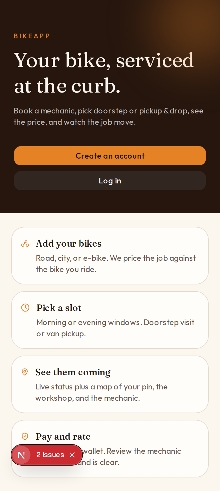
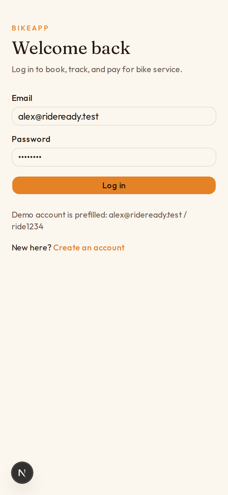
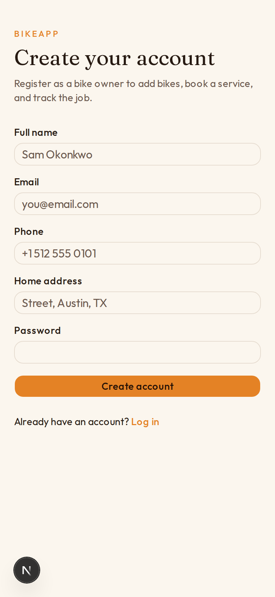
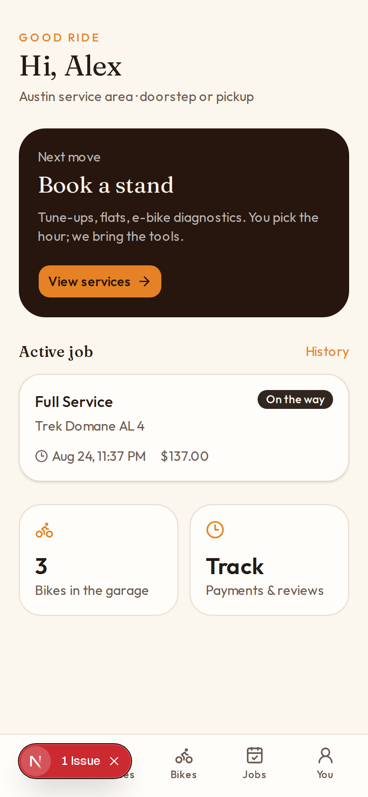
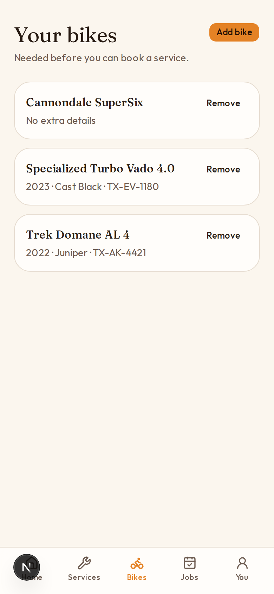
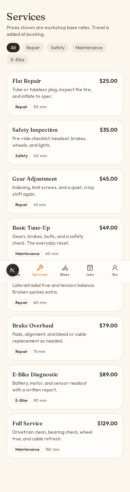
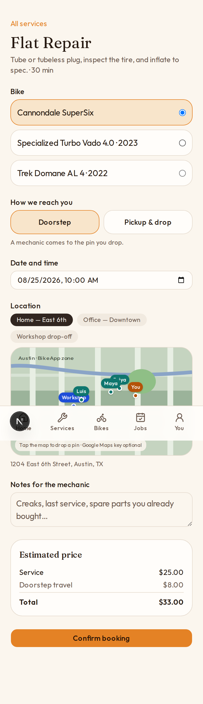
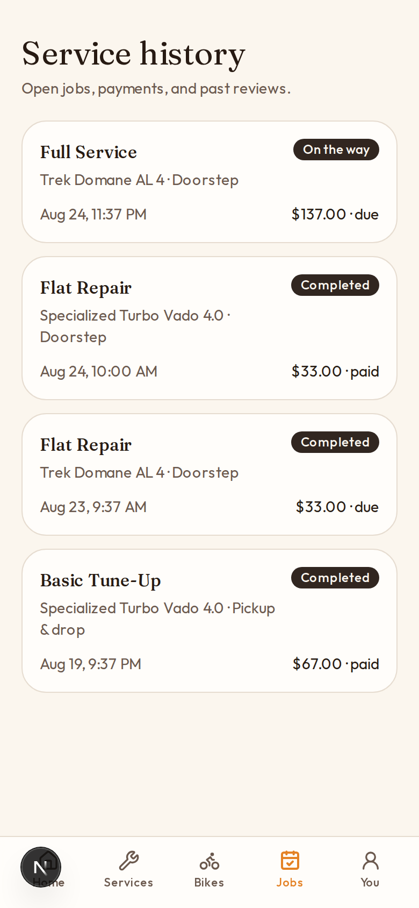
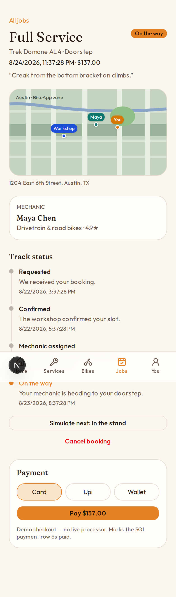
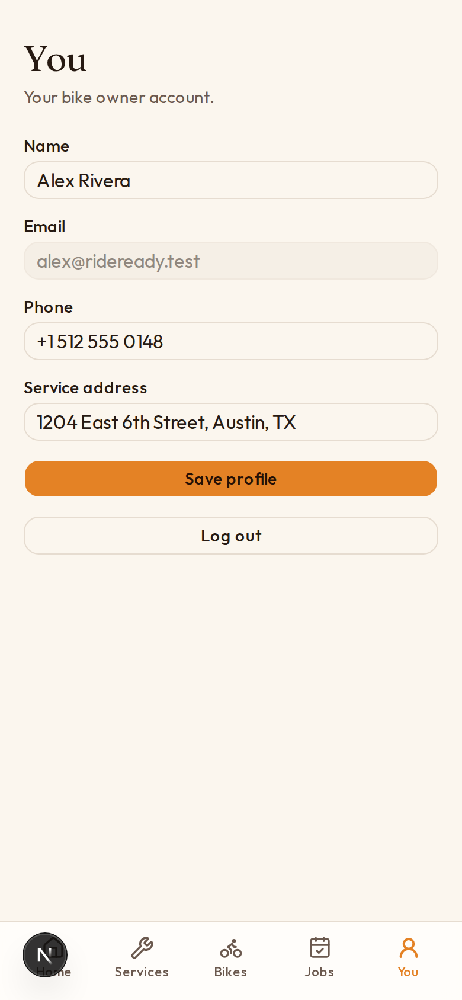

# Bike Service Manager

Customer bike-servicing app. A bike owner can create an account, add a bike, book a workshop job (doorstep or pickup & drop), see the price, track status, pay, and review the mechanic.

This repository was built in layers: **customer backend → services → payment → admin → bike / booking / review → frontend → this README.**

Browse (private): [https://cursor.com/codebase/jorgen-hima/bike-service-manager](https://cursor.com/codebase/jorgen-hima/bike-service-manager)

## What it does

| Step | What the customer does |
| --- | --- |
| Account | Register or log in |
| Bike | Add the bike that will be serviced |
| Service | Browse the catalog and pick a job |
| Booking | Pick date/time, doorstep or pickup & drop, drop a map pin |
| Price | See estimated total (service + travel) |
| Track | Follow status from requested to completed |
| History | Open past jobs |
| Pay | Card, UPI, or wallet (demo — stored in SQL, no live processor) |
| Review | Rate the assigned mechanic after the job is done |

Mechanic and Admin exist as **entities and SQL tables** for later screens. They are not separate apps in this slice.

## How it works

```
Browser (Next.js pages)
        │
        ▼
API routes in src/app/api/...
        │
        ▼
Prisma + SQLite (or MySQL / phpMyAdmin)
        │
        ▼
Entities: User → Customer | Mechanic | Admin
          Bike, Service, Booking, Payment, Review
```

1. The customer signs in. A signed cookie stores the session (`src/lib/auth.ts`).
2. Bikes, services, and bookings are JSON APIs under `src/app/api`.
3. A booking stores mode (`DOORSTEP` or `PICKUP_DROP`), slot, pin, and estimated price.
4. Status moves through requested → confirmed → assigned → on the way → in progress → ready → completed.
5. Payment marks the SQL `Payment` row as `PAID`.
6. A review updates the mechanic’s average rating.

TypeScript domain types live in `src/entities/`. The SQL schema is `prisma/schema.prisma`. phpMyAdmin import: `prisma/mysql-schema.sql`.

## Screens

Landing and account:







Home, bikes, and catalog:







Book, history, track / pay / review:









## Run locally

```bash
npm install
cp .env.example .env
npx prisma migrate dev
npm run dev
```

Open [http://127.0.0.1:43217](http://127.0.0.1:43217).

Demo password for all roles: `ride1234`

| Role | Email | Open after login |
| --- | --- | --- |
| Customer | alex@rideready.test | `/home` |
| Mechanic | maya@rideready.test | `/mechanic` |
| Admin | admin@rideready.test | `/admin` |

GitHub: [https://github.com/Himajori/Bike-Servicing-App](https://github.com/Himajori/Bike-Servicing-App)

The 17-step plan is in [docs/DEVELOPMENT-STEPS.md](docs/DEVELOPMENT-STEPS.md). UI reference: [docs/design-bikeservice.png](docs/design-bikeservice.png).

## Get this repository (Windows)

Origin CLI is **macOS, Linux, and WSL only** — not PowerShell. In **WSL**:

```bash
# Run in WSL (Origin CLI is not available in PowerShell)
# Install the Origin CLI
curl -fsSL https://downloads.cursor.com/origin/install.sh | sh

# Sign in (also sets up git credentials)
origin auth login

# Clone the repository
origin repo clone jorgen-hima/bike-service-manager
```

If `origin` is not found after install:

```bash
echo 'export PATH="$HOME/.local/bin:$PATH"' >> ~/.bashrc
source ~/.bashrc
```

Origin CLI docs: [https://cursor.com/docs/origin/cli](https://cursor.com/docs/origin/cli)

Visibility is **private**. You can change it in settings on the [codebase page](https://cursor.com/codebase/jorgen-hima/bike-service-manager).

## 17-step build

See [docs/DEVELOPMENT-STEPS.md](docs/DEVELOPMENT-STEPS.md) for requirements through admin dashboard (steps 1–17).
